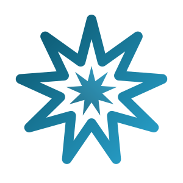
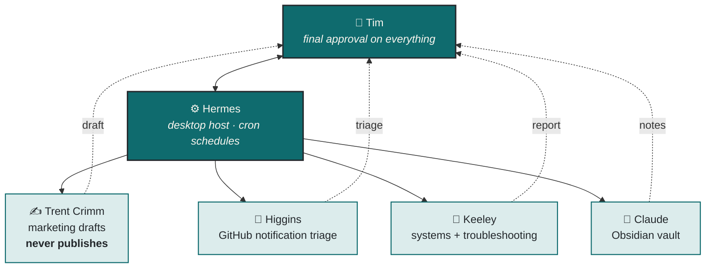

# Nine Point Labs

**I build small, useful things.**

 

---

## ✦ Whoami

I'm **Tim** — combat veteran, semi-retired technologist, part-time at an MSP, full-time dad in Whitehouse, Texas. I practice Tae Kwon Do with my daughters and spend the leftover hours in the workshop.

I write some of the code and **direct a small team of AI agents** for the rest. My one real skill is seeing clearly what a tool should *feel* like and being stubborn until it does.

> **Why nine?** In the Bahá'í Faith, nine is the number of completeness and of unity — especially the unity of humanity. Hence the nine-pointed star, and hence the name.

Influences: Ted Lasso and Andy Grammer. Optimism can be practical, kindness can be strong, and you can have grit without cynicism.

---

## ✦ The Workshop

<table>
<tr><td width="50%" valign="top">

### 🔐 [Omostrich](https://github.com/ninepointlabs/omostrich)
Local Nostr **key-custody daemon**. Holds an encrypted `nsec`, signs over a Unix socket for first-party Omarchy plugins, and answers NIP-46 remote-signing requests over relays.
 `QML` · `Nostr` · [site](https://github.com/ninepointlabs/omostrich-website)

</td><td width="50%" valign="top">

### 📊 [omostrich-db](https://github.com/ninepointlabs/omostrich-db)
Headless Nostr **read/analytics** sibling. Local `nostrdb` cache of your own notes and engagement, with MCP tools for agents. Never touches the signing vault.
 `JavaScript` · `MCP` · `nostrdb`

</td></tr>
<tr><td width="50%" valign="top">

### 🗄️ [Persistwise](https://ninepointlabs.com/projects)
Makes your writing **last**. Polls your feeds and archives every new post to the Wayback Machine and IPFS, plus a local copy on disk. First commercial offering — source private.
 `Rails 8` · `SQLite/WAL` · `Solid Queue`

</td><td width="50%" valign="top">

### 📦 [autonomix-cli](https://github.com/ninepointlabs/autonomix-cli)
Installs and tracks apps straight from **GitHub Releases** — Obtainium for the command line. Successor to [autonomix](https://github.com/ninepointlabs/autonomix) (⭐ 50).
 `Go` · `Linux`

</td></tr>
</table>

---

## ✦ Omarchy Desktop

> Quickshell/QML plugins for [Omarchy](https://omarchy.org) — Beautiful, Modern & Opinionated Linux. All shipped under the `ninepointlabs.*` namespace.

| Plugin | What it does | ⭐ |
|:--|:--|:--|
| [**barkeep**](https://github.com/ninepointlabs/barkeep) | Tends your bar — arrange, pin, update and remove shell plugins from one overlay |  |
| [**omarchy-spotify**](https://github.com/ninepointlabs/omarchy-spotify) | Cover-art chip, now-playing panel, search, playlists, podcasts, headless player |  |
| [**omarchy-fastmail-calendar**](https://github.com/ninepointlabs/omarchy-fastmail-calendar) | Native CalDAV calendar — Day/Week/Month/Year, day detail, add events |  |
| [**omarchy-fastmail**](https://github.com/ninepointlabs/omarchy-fastmail) | Live unread mail from every folder, via `fm-cli` |  |
| [**omarchy-theme-rotate**](https://github.com/ninepointlabs/omarchy-theme-rotate) | Randomize your theme on demand or auto-rotate on a schedule |  |
| [**omarchy-ring-cameras**](https://github.com/ninepointlabs/omarchy-ring-cameras) | Ring cameras in the bar — live view, snapshots, history, motion alerts |  |
| [**omarchy-upcoming**](https://github.com/ninepointlabs/omarchy-upcoming) | TVmaze watchlist and next-episode dates |  |
| [**omarchy-hermes-chat**](https://github.com/ninepointlabs/omarchy-hermes-chat) | Fire a quick message at my local Hermes agent without opening the app |  |
| [**omarchy-hey-calendar**](https://github.com/ninepointlabs/omarchy-hey-calendar) | The HEY-CLI-backed predecessor to the CalDAV one |  |

<b>🕹️ …and the ones that exist purely for fun</b>

 

| Plugin | What it does |
|:--|:--|
| [**omarchy-zorkmachy**](https://github.com/ninepointlabs/omarchy-zorkmachy) | Zork I, II and III in the bar, saved after every move |
| [**omarchy-dopewars**](https://github.com/ninepointlabs/omarchy-dopewars) | The classic *dopewars* — single player, saved between turns |
| [**omarchy-theme-us-army**](https://github.com/ninepointlabs/omarchy-theme-us-army) | Olive drab, Army gold, wallpapers from authentic division insignia |
| [**omarchy-ted-lasso-theme**](https://github.com/ninepointlabs/omarchy-ted-lasso-theme) | Believe. |
| [**omarchy-nene-royal**](https://github.com/ninepointlabs/omarchy-nene-royal) | A theme that got out of hand |

---

## ✦ Terminal Tools

CLI applications that live in the terminal where they belong.

| Tool | Lang | What it does |
|:--|:--|:--|
| [**fm-cli**](https://github.com/ninepointlabs/fm-cli)  | `Go` | Minimalist TUI email client for Fastmail over **JMAP** |
| [**autonomix-cli**](https://github.com/ninepointlabs/autonomix-cli) | `Go` | Install & track apps from GitHub Releases |
| [**tfz**](https://github.com/ninepointlabs/tfz) | `Ruby` | RSS/Atom reader that renders the *full* article. Novel concept, I know. |
| [**rjrnl**](https://github.com/ninepointlabs/rjrnl) | `Ruby` | Human-friendly command-line journal |
| [**writeapp**](https://github.com/ninepointlabs/writeapp) | `Rust` | Distraction-free writing, no window manager required |
| [**mb-cli**](https://github.com/ninepointlabs/mb-cli) | `Go` | A pretty CLI for posting to Micro.blog |
| [**sendit-cli**](https://github.com/ninepointlabs/sendit-cli) | `Ruby` | Post to Micro.blog and X at once, because copy-paste is for chumps |
| [**rubdupe**](https://github.com/ninepointlabs/rubdupe) | `Ruby` | Duplicate-file finder, written the week I ran out of disk again |

---

## ✦ Apps & Applets

| Project | Platform | What it does |
|:--|:--|:--|
| [**jrnl-droid**](https://github.com/ninepointlabs/jrnl-droid) | `Flutter` | Syncing-friendly Android client for [jrnl.sh](https://jrnl.sh) + Syncthing |
| [**Primal-Pal**](https://github.com/ninepointlabs/Primal-Pal) | `Flutter` | Greasing-the-groove fitness nagger — random exercise snacks all day |
| [**doh**](https://github.com/ninepointlabs/doh) | `Rust` | COSMIC applet: post to X, Bluesky, Nostr and Mastodon at once 🚀 |
| [**cosmic-applet-keyguide**](https://github.com/ninepointlabs/cosmic-applet-keyguide) | `Rust` | Searchable keyboard-shortcut cheatsheets for COSMIC |
| [**MB-Manager**](https://github.com/ninepointlabs/MB-Manager) | `Flutter` | Micro.blog management from your pocket |
| [**trekkie**](https://github.com/ninepointlabs/trekkie) | `Flutter` | 🖖 All 800+ Star Trek episodes in chronological order. Archived, still correct. |

---

## ✦ The Stack

**Daily drivers** — Arch Linux under [Omarchy](https://omarchy.org) (Hyprland) with COSMIC on the side, because vanilla GNOME is for people who don't like fun. Neovim or VS Code depending on whether I'm feeling terminal-purist that day. Rails 8 on SQLite + WAL with Solid Queue — no Redis, no Sidekiq, no regrets. Fastmail for mail and calendar, Obsidian for everything I think.

---

## ✦ The Agent Team

Nine Point Labs runs with a crew. They draft, triage and propose; **I** approve and publish.

Yes, they're named after Ted Lasso characters. No, I will not be taking questions.

Most of them reach my projects through **MCP servers** I wrote — [ninepointlabs.com](https://ninepointlabs.com) has one at `/mcp` so posts and projects can be managed remotely, and `omostrich-db` exposes Nostr analytics the same way. This website is a public example of human–AI collaboration, and I'm not shy about which parts the agents wrote.

---

## ✦ Currently

- Finishing **[omarchy-fastmail-calendar](https://github.com/ninepointlabs/omarchy-fastmail-calendar)** — a native CalDAV calendar for the Omarchy bar that works with any CalDAV server, not just Fastmail.
- Rebuilding **[ninepointlabs.com](https://ninepointlabs.com)** in Rails 8 — two blogs, a projects manager, and an MCP server at `/mcp` so my agents can post without me.
- Teaching **[barkeep](https://github.com/ninepointlabs/barkeep)** to manage every other plugin I keep writing, because the bar got crowded.
- Whatever idea won't leave me alone this week. There's usually one.

---

## ✦ By the Numbers

<picture>
  <source media="(prefers-color-scheme: dark)" srcset="https://github-profile-summary-cards.vercel.app/api/cards/profile-details?username=ninepointlabs&theme=github_dark" />
  
</picture>

 

<picture>
  <source media="(prefers-color-scheme: dark)" srcset="https://github-profile-summary-cards.vercel.app/api/cards/repos-per-language?username=ninepointlabs&theme=github_dark" />
  
</picture>
<picture>
  <source media="(prefers-color-scheme: dark)" srcset="https://github-profile-summary-cards.vercel.app/api/cards/most-commit-language?username=ninepointlabs&theme=github_dark" />
  
</picture>

 

<picture>
  <source media="(prefers-color-scheme: dark)" srcset="https://streak-stats.demolab.com?user=ninepointlabs&hide_border=true&background=14171A&stroke=4FD1C5&ring=4FD1C5&fire=4FD1C5&currStreakLabel=4FD1C5&sideLabels=ECE8DE&currStreakNum=ECE8DE&sideNums=ECE8DE&dates=9A9D94" />
  
</picture>

---

### ✦ Elsewhere

[**ninepointlabs.com**](https://ninepointlabs.com) — projects, blog and journal, all in one place
· [**X**](https://x.com/ninepointlabs)
· [**Nostr**](https://njump.me/npub13hyx3qsqk3r7ctjqrr49uskut4yqjsxt8uvu4rekr55p08wyhf0qq90nt7)
· [**hello@ninepointlabs.com**](mailto:hello@ninepointlabs.com)

 

*I build small, useful things. Sometimes other people find them useful too.*

Linux user who will absolutely judge your OS choice, then offer to help you switch distros anyway.

<!---
ninepointlabs/ninepointlabs is a ✨ special ✨ repository because its `README.md` (this file)
appears on your GitHub profile. Click Preview above to see changes before committing.
--->
